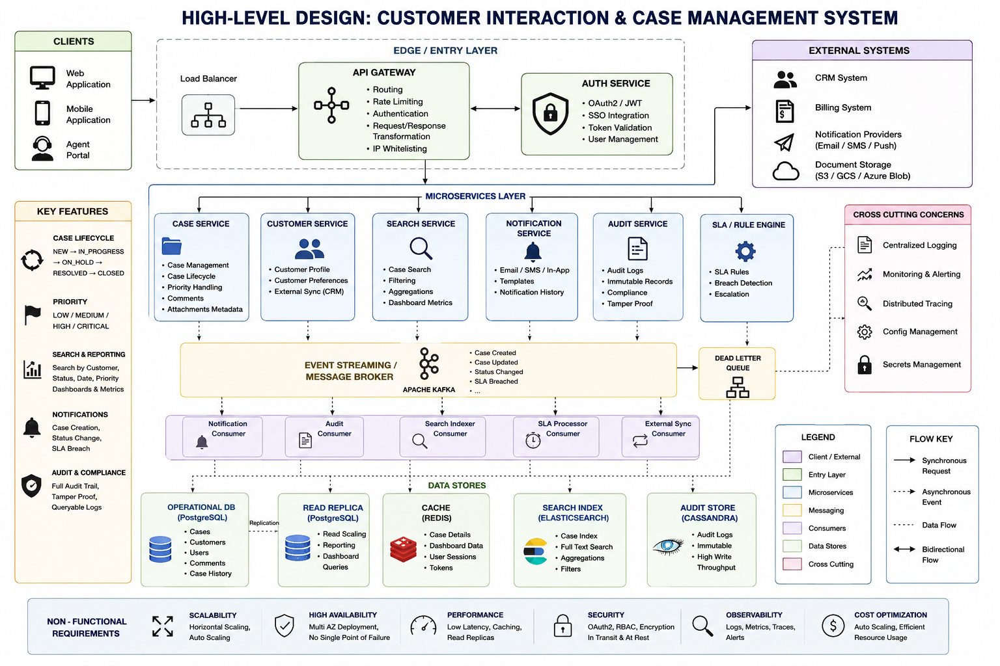

Case Management System
High-Level Design: Customer Interaction & Case Management System

## Overview

This document describes the design of a scalable, secure, and highly available backend platform for managing customer interactions and case lifecycles at enterprise scale.

## Assumptions
- Peak users: ~**50K** concurrent
- Total cases: **100M**+
- Read-heavy system (70% reads)

## High-Level Architecture
Clients → **API** Gateway → Services → Databases / Cache / Search → External Systems

## Architecture Style

### Modular Microservices Architecture

## Services
- Case Service
- Customer Service
- Search Service
- Notification Service
- Audit Service
- Auth Service

## Data Design
- PostgreSQL (core)
- Elasticsearch (search)
- Redis (cache)
- Cassandra (audit logs)

## Async Processing
Event-driven using Kafka

## Security

- OAuth2 + **JWT**
- **RBAC**
- Encryption (**TLS** + at rest)
## Observability
- Logging, metrics, tracing
- Alerts and health checks
## Scalability
- Horizontal scaling
- Caching
- Read replicas
## Failure Handling
- Traffic spikes → autoscaling
- DB slowdown → replicas + fallback
- Queue backlog → scale consumers
12. APIs
- **POST** /cases
- **PATCH** /cases/{id}/status
- **GET** /cases (search with pagination)
## Trade-offs
- Microservices vs Monolith
- PostgreSQL vs NoSQL
- Kafka vs RabbitMQ
- Elasticsearch trade-offs
## Future Improvements
- Multi-region
- AI-based automation
- Real-time analytics

